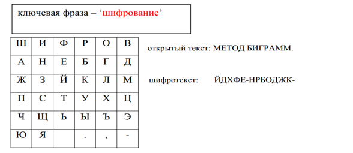

<h2 align="center">Курсовая работа (2022) </h2>
<h1 align="center">Шифрование текста биграммами </h1>

<h4>Указания к выполнению задания</h4>  

В начале XVI века аббат из Германии Иоганн Трисемус предложил шифровать по две буквы за раз. Шифры, использующие подобный принцип, были названы биграммными. Обычно такие шифры используют таблицы, аналогичные квадрату Полибия, заполненные символами используемого алфавита. Наиболее известный шифр биграммами называется Playfair. Он применялся Великобританией в Первую мировую войну. Открытый текст разбивался на пары букв (биграммы) и текст шифровки строился из него по следующим трём очень простым правилам (cм. рисунок).

 1. Если обе буквы биграммы исходного текста принадлежат одной колонке таблицы, то буквами шифра считаются буквы, которые лежат под ними. Так би- грамма ИН дает текст шифровки НЗ. Если буква открытого текста находится в нижнем ряду, то для шифра берется соответствующая буква из верхнего ряда и биграмма НЯ дает шифр ЗИ. (Биграмма из одной буквы или пары одинаковых букв тоже подчиняется этому правилу, и текст ОО дает шифр ГГ). 

2. Если обе буквы биграммы исходного текста принадлежат одной строке таблицы, то буквами шифра считаются буквы, которые лежат справа от них. Так биграмма АБ дает текст шифровки НГ. Если буква открытого текста находится в крайней правой колонке, то для шифра берется буква из крайней левой колонки той же строки и биграмма АД дает шифр НА. 

3. Если обе буквы биграммы открытого текста лежат в разных рядах и колонках, то вместо них берутся такие две буквы, чтобы вся их четверка представляла прямоугольник. Например, биграмма ЕК шифруется как БЙ (КЕ зашифруется ЙБ). 
Заполнение квадрата алфавитом может быть случайным, а может определяться некоторой ключевой фразой, все символы которой (но без повторений) записываются в начале матрицы, а затем по порядку выписываются остальные буквы алфавита. 

