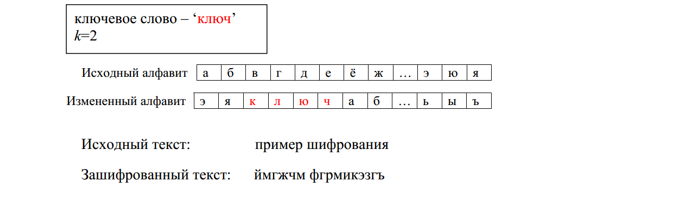

<h2 align="center">Курсовая работа (2022) </h2>
<h1 align="center">Шифрование текста шифром Цезаря с ключевым словом</h1>

<h4> В программе присутствует как шифрование, так и дешифровка</h4>

<h4>Указания к выполнению задания</h4>  
В данной разновидности шифра Цезаря ключ задается числом k (0<=k<=n-1) и коротким ключевым словом или предложением. Выписывается алфавит, а под ним, начиная с k-й позиции, ключевое слово. Оставшиеся буквы записываются в алфавитном порядке после ключевого слова. В итоге мы получаем подстановку для каждой буквы. Требование, чтобы все буквы ключевого слова были различными не обязательно, необходимо только записывать ключевое слово без повторения одинаковых букв (рис.1). 

