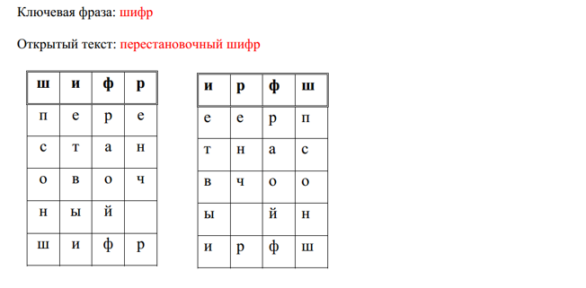

<h2 align="center">Курсовая работа (2022) </h2>
<h1 align="center">Шифрование текста перестановочным шифром с ключевым словом</h1>

<h4> В программе присутствует как шифрование, так и дешифровка</h4>

<h4>Указания к выполнению задания</h4>  

Буквы ключевого слова без повторений записываются в первую строку таблицы, определяя таким образом количество ее столбцов. Буквы сообщения записываются в таблицу построчно. Сформированная таким образом таблица сортируется по столбцам, критерием сортировки является порядок следования символа первой строки в алфавите. После сортировки шифрованный текст переписывается по столбцам (см. рисунок).

Шифротекст: етвыиенч рраойфпсонш

Дешифрация осуществляется по известному ключу обратными преобразованиями шифротекста в таблице: сначала шифротекст вписывается в таблицу по столбцам, затем столбцы переставляются, после чего открытый текст извлекается из таблицы построчно. 

