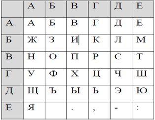

<h2 align="center">Курсовая работа (2022) </h2>
<h1 align="center">Шифрование текста квадратом Полибия</h1>

<h4> В программе присутствует как шифрование, так и дешифровка</h4>

<h4>Указания к выполнению задания</h4>  
Одной модификацией одноалфавитной замены является квадрат Полибия, в котором символ алфавита заменяется парой чисел или символов по определенному правилу.

В такой прямоугольник записывается алфавит, причем схема записи держится в тайне и составляет ключ шифрования.
В процессе шифрования каждая буква открытого текста представляется в шифротексте парой букв, указывающих строку и столбец, в которых расположена данная буква. Так представлениями букв В, Г, П, У будут АВ, АГ, ВВ, ГА соответственно. 
Если использовать приведенный выше квадрат в качестве ключа шифрования, то фраза «ПРИМЕР» будет зашифрована в «ВВВГБВБЕАЕВГ».

