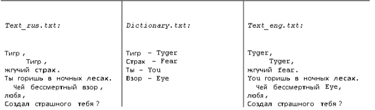

<h2 align="center">Курсовая работа (2022) </h2>
<h1 align="center">Разработка простейшего переводчика  </h1>

<h4>Указания к выполнению задания</h4>  

Запуск программы должен производиться со следующими аргументами командной строки:  

Программа должна перевести текст в файле text_rus.txt с помощью словаря dictionary.txt, и записать результат в файл text_eng.txt. Примерное содержимое файлов и результат работы программы представлен на рисунке 2.   

Форматирование текста в файле text_rus.txt должно быть сохранено и в итоговом файле text_eng.txt, т.е. сохранены все сдвиги и переносы по тексту. Задание не предусматривает поиск однокоренных слов, поэтому замена слова происходит только по полному соответствию.  

